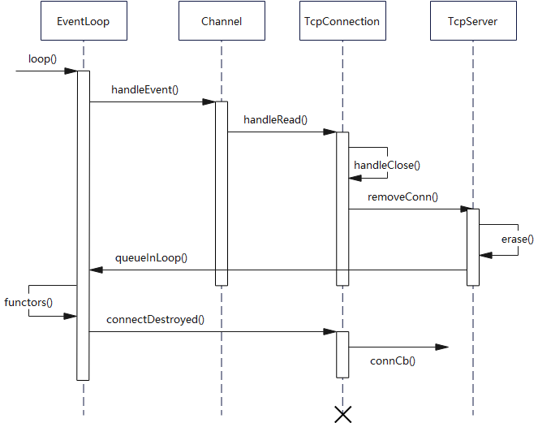

# Acceptor类详解
Acceptor是一个muduo库中的内部类，它用于处理客户端发送过来的连接请求。
```cpp
class Acceptor : noncopyable
{
 public:
  typedef std::function<void (int sockfd, const InetAddress&)> NewConnectionCallback;

  Acceptor(EventLoop* loop, const InetAddress& listenAddr, bool reuseport);
  ~Acceptor();

  void setNewConnectionCallback(const NewConnectionCallback& cb)
  { newConnectionCallback_ = cb; }

  void listen();

  bool listening() const { return listening_; }

  // Deprecated, use the correct spelling one above.
  // Leave the wrong spelling here in case one needs to grep it for error messages.
  // bool listenning() const { return listening(); }

 private:
  void handleRead();

  EventLoop* loop_;
  Socket acceptSocket_;
  Channel acceptChannel_;
  NewConnectionCallback newConnectionCallback_;
  bool listening_;
  int idleFd_;
};
```
Acceptor的成员变量较为简单，loop_是所属EventLoop指针，acceptSocket_是用于接收连接请求的Socket对象（Socket对象是一个 RAIIhandle，封装了socket文件描述符的生命期），acceptChannel_是acceptSocket_的sockfd对应的Channel，newConnectionCallback_是新建连接时的回调函数，listening_标识是否已经开始监听，idleFd_用于解决fd资源用尽的情况，后面介绍。

## 构造和析构函数
```cpp
Acceptor::Acceptor(EventLoop* loop, const InetAddress& listenAddr, bool reuseport)
  : loop_(loop),
    acceptSocket_(sockets::createNonblockingOrDie(listenAddr.family())),
    acceptChannel_(loop, acceptSocket_.fd()),
    listening_(false),
    idleFd_(::open("/dev/null", O_RDONLY | O_CLOEXEC))
{
  assert(idleFd_ >= 0);
  acceptSocket_.setReuseAddr(true);
  acceptSocket_.setReusePort(reuseport);
  acceptSocket_.bindAddress(listenAddr);
  acceptChannel_.setReadCallback(
      std::bind(&Acceptor::handleRead, this));
}
```
Acceptor的构造函数接受三个参数，分别是loop，listenAddr，reuseport，loop是Acceptor所属的EventLoop，用于初始化loop_，listenAddr是Acceptor的监听地址，reuseport是一个设置参数，用来设置acceptSocket_是否启用端口复用。

初始化过程中，调用createNonblockingOrDie函数来创建一个非阻塞的socket，返回fd，然后用该sockfd初始化acceptSocket_对象，同时初始化acceptChannel_。

这里解释下idleFd_的用途，fd资源存在上限，假如系统的fd资源用尽，那么当新连接请求到达时，accept4会失败，那么连接请求一直存在，acceptChannel_会一直监听到可读事件，从而回调相同的失败代码。因此，我们可以在初始化阶段申请一个空闲的fd留作备用，当fd资源用尽时，我们暂时关闭该fd，，此时有空闲fd，accept可以成功创建socket，然后我们立马关闭该socket，这样连接请求就会消失。这里，在初始化阶段，将空闲fd指向文件"/dev/null"。

构造函数会默认启动acceptSocket_的地址复用，然后根据reuseport设置端口复用，并将acceptSocket_绑定到listenAddr上，并为acceptChannel_设置ReadCallback。

```cpp
Acceptor::~Acceptor()
{
  acceptChannel_.disableAll();
  acceptChannel_.remove();
  ::close(idleFd_);
}
```
析构函数关闭并移除acceptChannel_通道，并关闭idleFd_。

## 监听函数

```cpp
void Acceptor::listen()
{
  loop_->assertInLoopThread();
  listening_ = true;
  acceptSocket_.listen();
  acceptChannel_.enableReading();
}
```
Acceptor创建完成后，会调用listen函数开始监听，首先会调用acceptSocket_的listen，开始监听socket，然后为acceptChannel_设置关注可读事件，开始监听可读事件。

## 处理连接请求

在构造函数中，将acceptChannel_的ReadCallback设置为handleRead，因此，当一个连接请求到达后，acceptChannel_会产生可读事件，此时调用handleRead回调函数：
```cpp
void Acceptor::handleRead()
{
  loop_->assertInLoopThread();
  InetAddress peerAddr;
  //FIXME loop until no more
  int connfd = acceptSocket_.accept(&peerAddr);
  if (connfd >= 0)
  {
    // string hostport = peerAddr.toIpPort();
    // LOG_TRACE << "Accepts of " << hostport;
    if (newConnectionCallback_)
    {
      newConnectionCallback_(connfd, peerAddr);
    }
    else
    {
      sockets::close(connfd);
    }
  }
  else
  {
    LOG_SYSERR << "in Acceptor::handleRead";
    // Read the section named "The special problem of
    // accept()ing when you can't" in libev's doc.
    // By Marc Lehmann, author of libev.
    if (errno == EMFILE)
    {
      ::close(idleFd_);
      idleFd_ = ::accept(acceptSocket_.fd(), NULL, NULL);
      ::close(idleFd_);
      idleFd_ = ::open("/dev/null", O_RDONLY | O_CLOEXEC);
    }
  }
}
```

handleRead会调用acceptSocket_的accept函数，来获得一个新的sockfd以及对端的ip地址，如果设置了新建连接回调则调用，如果没有设置则直接关闭该sockfd。accept可能会失败，返回一个负值fd，此时可能是由于fd用尽，也就是errno == EMFILE，那么此时就需要用到idleFd_了，我们先关闭idleFd_，此时系统会暂时有一个空闲fd，我们再次accept与请求建立连接，之后又迅速关闭该sockfd，再将idleFd_重新指向"/dev/null"，这样就消除了连接请求，而不会一直触发可读事件。

# TcpServer类详解

TcpServer类用来管理TcpConnection，暴露给用户使用，因此它的接口都比较简单，基本上都是用来设置一些Callback，最后运行start()来启动。

```cpp
class TcpServer : noncopyable
{
 public:
  typedef std::function<void(EventLoop*)> ThreadInitCallback;
  enum Option
  {
    kNoReusePort,
    kReusePort,
  };

  //TcpServer(EventLoop* loop, const InetAddress& listenAddr);
  TcpServer(EventLoop* loop,
            const InetAddress& listenAddr,
            const string& nameArg,
            Option option = kNoReusePort);
  ~TcpServer();  // force out-line dtor, for std::unique_ptr members.

  const string& ipPort() const { return ipPort_; }
  const string& name() const { return name_; }
  EventLoop* getLoop() const { return loop_; }

  /// Set the number of threads for handling input.
  ///
  /// Always accepts new connection in loop's thread.
  /// Must be called before @c start
  /// @param numThreads
  /// - 0 means all I/O in loop's thread, no thread will created.
  ///   this is the default value.
  /// - 1 means all I/O in another thread.
  /// - N means a thread pool with N threads, new connections
  ///   are assigned on a round-robin basis.
  void setThreadNum(int numThreads);
  void setThreadInitCallback(const ThreadInitCallback& cb)
  { threadInitCallback_ = cb; }
  /// valid after calling start()
  std::shared_ptr<EventLoopThreadPool> threadPool()
  { return threadPool_; }

  /// Starts the server if it's not listening.
  ///
  /// It's harmless to call it multiple times.
  /// Thread safe.
  void start();

  /// Set connection callback.
  /// Not thread safe.
  void setConnectionCallback(const ConnectionCallback& cb)
  { connectionCallback_ = cb; }

  /// Set message callback.
  /// Not thread safe.
  void setMessageCallback(const MessageCallback& cb)
  { messageCallback_ = cb; }

  /// Set write complete callback.
  /// Not thread safe.
  void setWriteCompleteCallback(const WriteCompleteCallback& cb)
  { writeCompleteCallback_ = cb; }

 private:
  /// Not thread safe, but in loop
  void newConnection(int sockfd, const InetAddress& peerAddr);
  /// Thread safe.
  void removeConnection(const TcpConnectionPtr& conn);
  /// Not thread safe, but in loop
  void removeConnectionInLoop(const TcpConnectionPtr& conn);

  typedef std::map<string, TcpConnectionPtr> ConnectionMap;

  EventLoop* loop_;  // the acceptor loop
  const string ipPort_;
  const string name_;
  std::unique_ptr<Acceptor> acceptor_; // avoid revealing Acceptor
  std::shared_ptr<EventLoopThreadPool> threadPool_;
  ConnectionCallback connectionCallback_;
  MessageCallback messageCallback_;
  WriteCompleteCallback writeCompleteCallback_;
  ThreadInitCallback threadInitCallback_;
  AtomicInt32 started_;
  // always in loop thread
  int nextConnId_;
  ConnectionMap connections_;
};
```
TcpServer的私有成员变量：loop_指向所属的EventLoop；ipPort_是TcpServer监听的ip地址和端口；name_是名字；acceptor_指向Acceptor对象，用来接受连接请求，使用unique_ptr管理，避免手动释放；threadPool_是一个EventLoop线程池，用于支持多线程的TcpServer，使用shared_ptr管理；Connection/Message/WriteComplete Callback_三个Callback可以由用户设置，并且在创建TcpConnection时会将这些Callback传递进去；threadInitCallback_是线程池启动线程时的初始化回调函数；started_用来标识TcpServer是否启动，是一个原子变量；nextConnId_用来记录当前已创建的连接数，在为TcpConnection起名时也会用到；connections_是一个TcpConnection名称到指针的map；

## 构造和析构函数

```cpp
TcpServer::TcpServer(EventLoop* loop,
                     const InetAddress& listenAddr,
                     const string& nameArg,
                     Option option)
  : loop_(CHECK_NOTNULL(loop)),
    ipPort_(listenAddr.toIpPort()),
    name_(nameArg),
    acceptor_(new Acceptor(loop, listenAddr, option == kReusePort)),
    threadPool_(new EventLoopThreadPool(loop, name_)),
    connectionCallback_(defaultConnectionCallback),
    messageCallback_(defaultMessageCallback),
    nextConnId_(1)
{
  acceptor_->setNewConnectionCallback(
      std::bind(&TcpServer::newConnection, this, _1, _2));
}
```
构造函数中根据传入参数来初始化loop_，ipPort_，name_等，创建一个新的Acceptor对象并初始化acceptor_，创建一个新的EventLoopThreadPool对象并初始化threadPool_，用默认的回调函数来初始化connectionCallback_和messageCallback_，nextConnId_初始化为1；将newConnection成员函数设置为acceptor_的新建连接回调函数。

```cpp
TcpServer::~TcpServer()
{
  loop_->assertInLoopThread();
  LOG_TRACE << "TcpServer::~TcpServer [" << name_ << "] destructing";

  for (auto& item : connections_)
  {
    TcpConnectionPtr conn(item.second);
    item.second.reset();
    conn->getLoop()->runInLoop(
      std::bind(&TcpConnection::connectDestroyed, conn));
  }
}
```

由于大部分资源由智能指针管理，不需要手动释放，因此析构函数做的事情很简单，只需要对connections_中的每个TcpConnection执行connectDestroyed。

## start函数
TcpServer通过start函数来启动，start函数做的事其实很简单，将started_置1，启动线程池，之后再loop_中执行acceptor_的listen函数，开始监听连接请求：
```cpp
void TcpServer::start()
{
  if (started_.getAndSet(1) == 0)
  {
    threadPool_->start(threadInitCallback_);

    assert(!acceptor_->listening());
    loop_->runInLoop(
        std::bind(&Acceptor::listen, get_pointer(acceptor_)));
  }
}
```

## newConnection函数
构造函数中将newConnection函数设置为acceptor_的新建连接回调函数，也就是每次新建一个Tcp连接，就会调用该函数：
```cpp
void TcpServer::newConnection(int sockfd, const InetAddress& peerAddr)
{
  loop_->assertInLoopThread();
  EventLoop* ioLoop = threadPool_->getNextLoop();
  char buf[64];
  snprintf(buf, sizeof buf, "-%s#%d", ipPort_.c_str(), nextConnId_);
  ++nextConnId_;
  string connName = name_ + buf;

  LOG_INFO << "TcpServer::newConnection [" << name_
           << "] - new connection [" << connName
           << "] from " << peerAddr.toIpPort();
  InetAddress localAddr(sockets::getLocalAddr(sockfd));
  // FIXME poll with zero timeout to double confirm the new connection
  // FIXME use make_shared if necessary
  TcpConnectionPtr conn(new TcpConnection(ioLoop,
                                          connName,
                                          sockfd,
                                          localAddr,
                                          peerAddr));
  connections_[connName] = conn;
  conn->setConnectionCallback(connectionCallback_);
  conn->setMessageCallback(messageCallback_);
  conn->setWriteCompleteCallback(writeCompleteCallback_);
  conn->setCloseCallback(
      std::bind(&TcpServer::removeConnection, this, _1)); // FIXME: unsafe
  ioLoop->runInLoop(std::bind(&TcpConnection::connectEstablished, conn));
}
```
首先从线程池中获取一个线程的EventLoop；之后根据TcpServer的name_和nextCondId_来为新连接取名；获取sockfd对应的本地ip和端口号，创建一个新的TcpConnection对象，并创建对应的shared_ptr；将该TcpConnection对象加入到connections_中，并为其设置各种回调函数；这里CloseCallback是固定的，为TcpServer的removeConnection成员函数；最后在loop_中执行Tcpconnection的connectEstablished函数，连接建立完成。

removeConnection函数：
```cpp
void TcpServer::removeConnection(const TcpConnectionPtr& conn)
{
  // FIXME: unsafe
  loop_->runInLoop(std::bind(&TcpServer::removeConnectionInLoop, this, conn));
}

void TcpServer::removeConnectionInLoop(const TcpConnectionPtr& conn)
{
  loop_->assertInLoopThread();
  LOG_INFO << "TcpServer::removeConnectionInLoop [" << name_
           << "] - connection " << conn->name();
  size_t n = connections_.erase(conn->name());
  (void)n;
  assert(n == 1);
  EventLoop* ioLoop = conn->getLoop();
  ioLoop->queueInLoop(
      std::bind(&TcpConnection::connectDestroyed, conn));
}
```
removeConnection
会在loop_中执行removeConnectionInLoop来真正移除连接。

首先从connections_中移除该TcpConnection，然后再执行TcpConnection的connectDestroyed函数来销毁TcpConnection对象。

# TcpConnection详解
TcpConnection是muduo中最核心也是最复杂的class，TcpConnection默认使用shared_ptr来管理，并且它继承自enable_shared_from_this，这样可以在类内获得一个指向自身的shared_ptr。之所以这样做，是因为TcpConnection的生命期极其复杂和模糊，必须借助于shared_ptr来管理。

```cpp
class TcpConnection : noncopyable,
                      public std::enable_shared_from_this<TcpConnection>
{
 public:
  /// Constructs a TcpConnection with a connected sockfd
  ///
  /// User should not create this object.
  TcpConnection(EventLoop* loop,
                const string& name,
                int sockfd,
                const InetAddress& localAddr,
                const InetAddress& peerAddr);
  ~TcpConnection();

  EventLoop* getLoop() const { return loop_; }
  const string& name() const { return name_; }
  const InetAddress& localAddress() const { return localAddr_; }    //获取本地IP地址
  const InetAddress& peerAddress() const { return peerAddr_; }     //获取对端IP地址
  bool connected() const { return state_ == kConnected; }
  bool disconnected() const { return state_ == kDisconnected; }
  // return true if success.
  bool getTcpInfo(struct tcp_info*) const;  //获取Tcp信息
  string getTcpInfoString() const;      //将Tcp信息转换成字符串

  // void send(string&& message); // C++11
  void send(const void* message, int len);
  void send(const StringPiece& message);
  // void send(Buffer&& message); // C++11
  void send(Buffer* message);  // this one will swap data
  void shutdown(); // NOT thread safe, no simultaneous calling
  // void shutdownAndForceCloseAfter(double seconds); // NOT thread safe, no simultaneous calling
  void forceClose();
  void forceCloseWithDelay(double seconds);
  void setTcpNoDelay(bool on);
  // reading or not
  void startRead();
  void stopRead();
  bool isReading() const { return reading_; }; // NOT thread safe, may race with start/stopReadInLoop

  void setContext(const std::any& context)
  { context_ = context; }

  const std::any& getContext() const
  { return context_; }

  std::any* getMutableContext()
  { return &context_; }

  void setConnectionCallback(const ConnectionCallback& cb)
  { connectionCallback_ = cb; }

  void setMessageCallback(const MessageCallback& cb)
  { messageCallback_ = cb; }

  void setWriteCompleteCallback(const WriteCompleteCallback& cb)
  { writeCompleteCallback_ = cb; }

  void setHighWaterMarkCallback(const HighWaterMarkCallback& cb, size_t highWaterMark)
  { highWaterMarkCallback_ = cb; highWaterMark_ = highWaterMark; }

  /// Advanced interface
  Buffer* inputBuffer()
  { return &inputBuffer_; }

  Buffer* outputBuffer()
  { return &outputBuffer_; }

  /// Internal use only.
  void setCloseCallback(const CloseCallback& cb)
  { closeCallback_ = cb; }

  // called when TcpServer accepts a new connection
  void connectEstablished();   // should be called only once
  // called when TcpServer has removed me from its map
  void connectDestroyed();  // should be called only once

 private:
  enum StateE { kDisconnected, kConnecting, kConnected, kDisconnecting };
  void handleRead(Timestamp receiveTime); // 处理读事件
  void handleWrite();                     // 处理写事件  
  void handleClose();                     // 处理关闭连接事件
  void handleError();                     // 处理错误事件
  // void sendInLoop(string&& message);
  // 在loop线程中发送消息
  void sendInLoop(const StringPiece& message);
  void sendInLoop(const void* message, size_t len);
  
  // 在loop线程中关闭写连接
  void shutdownInLoop();
  // void shutdownAndForceCloseInLoop(double seconds);
  // 在loop线程中强制关闭连接
  void forceCloseInLoop();
  void setState(StateE s) { state_ = s; }
  const char* stateToString() const;

  // 在loop线程中开始关注读事件
  void startReadInLoop();
  // 在loop线程中停止关注读事件
  void stopReadInLoop();

  EventLoop* loop_;                             // 所属EventLoop
  const string name_;                           // 名称
  StateE state_;  // FIXME: use atomic variable // 状态
  bool reading_;                                // 是否正在关注读事件
  // we don't expose those classes to client.  
  std::unique_ptr<Socket> socket_;              // 连接对应的Socket对象
  std::unique_ptr<Channel> channel_;            // 对sockfd负责的Channel
  const InetAddress localAddr_;                 // 本地ip地址
  const InetAddress peerAddr_;                  // 对端ip地址
  ConnectionCallback connectionCallback_;       // 连接回调
  MessageCallback messageCallback_;             // 收到消息后的回调
  WriteCompleteCallback writeCompleteCallback_; // 写完成回调
  HighWaterMarkCallback highWaterMarkCallback_; // 高水位回调
  CloseCallback closeCallback_;                 // 关闭回调
  size_t highWaterMark_;                        // 高水位阈值
  Buffer inputBuffer_;                          // 输入buffer
  Buffer outputBuffer_; // FIXME: use list<Buffer> as output buffer. // 输出buffer
  std::any context_;                            // 用户自定义参数
  // FIXME: creationTime_, lastReceiveTime_
  //        bytesReceived_, bytesSent_
};
```

## 构造和析构函数

```cpp
TcpConnection::TcpConnection(EventLoop* loop,
                             const string& nameArg,
                             int sockfd,
                             const InetAddress& localAddr,
                             const InetAddress& peerAddr)
  : loop_(CHECK_NOTNULL(loop)),
    name_(nameArg),
    state_(kConnecting),
    reading_(true),
    socket_(new Socket(sockfd)),
    channel_(new Channel(loop, sockfd)),
    localAddr_(localAddr),
    peerAddr_(peerAddr),
    highWaterMark_(64*1024*1024)
{
  channel_->setReadCallback(
      std::bind(&TcpConnection::handleRead, this, _1));
  channel_->setWriteCallback(
      std::bind(&TcpConnection::handleWrite, this));
  channel_->setCloseCallback(
      std::bind(&TcpConnection::handleClose, this));
  channel_->setErrorCallback(
      std::bind(&TcpConnection::handleError, this));
  LOG_DEBUG << "TcpConnection::ctor[" <<  name_ << "] at " << this
            << " fd=" << sockfd;
  socket_->setKeepAlive(true);
}
```
构造函数主要完成一些私有成员的初始化，包括socket_和channel_等对象，然后将TcpConnection的各种handle函数设置为channel_的各种回调函数，在channel_监听到各种事件后会回调这些handle函数。

```cpp
TcpConnection::~TcpConnection()
{
  LOG_DEBUG << "TcpConnection::dtor[" <<  name_ << "] at " << this
            << " fd=" << channel_->fd()
            << " state=" << stateToString();
  assert(state_ == kDisconnected);
}
```
所有资源都由智能指针管理，因此析构函数几乎不需要做任何事情。

## 接收消息
TcpConnection当接收到消息后，channel_会触发可读事件，之后会调用ReadCallback，也就是TcpConnection的handleRead函数：
```cpp
void TcpConnection::handleRead(Timestamp receiveTime)
{
  loop_->assertInLoopThread();
  int savedErrno = 0;
  ssize_t n = inputBuffer_.readFd(channel_->fd(), &savedErrno);
  if (n > 0)
  {
    messageCallback_(shared_from_this(), &inputBuffer_, receiveTime);
  }
  else if (n == 0)
  {
    handleClose();
  }
  else
  {
    errno = savedErrno;
    LOG_SYSERR << "TcpConnection::handleRead";
    handleError();
  }
}
```
handleRead会首先调用inputBuffer_的readFd函数，将数据从sockfd上督导inputBuffer_中，readFd返回读到的字节数n，如果读到了数据，n大于0，那么调用messageCallback_来处理数据，如果没有读到数据，n==0,那么说明对端希望断开连接，那么调用handleClose来处理断开连接，如果n<0，那么说明出错，调用handleError来处理错误。

## 断开连接
muduo中有2种关闭连接的方式：

1) 被动关闭：即对端先关闭连接，本地read(2)返回0，触发关闭逻辑，调用handleClose。

2) 主动关闭：利用forceClose()或forceCloseWithDelay()成员函数调用handleClose，强制关闭或强制延时关闭连接。

被动关闭的流程如下图，"X"表示Tcpconnection的析构位置



由上图可知，当对端关闭连接时，channel_首先触发可读事件，会回调TcpConnection的handelRead函数，之后从sockfd上读取数据，读到的字节数为0，说明对端断开连接，调用handleClose：

```cpp
void TcpConnection::handleClose()
{
  loop_->assertInLoopThread();
  LOG_TRACE << "fd = " << channel_->fd() << " state = " << stateToString();
  assert(state_ == kConnected || state_ == kDisconnecting);
  // we don't close fd, leave it to dtor, so we can find leaks easily.
  setState(kDisconnected);
  channel_->disableAll();

  TcpConnectionPtr guardThis(shared_from_this());
  connectionCallback_(guardThis);
  // must be the last line
  closeCallback_(guardThis);
}
```

这里先将TcpConnection的状态设置为kDisconnected，然后关闭channel_，然后调用connectionCallback_（为什么？）和closeCallback_。closeCallback_在TcpServer创建TcpConnection对象时就已经被设置为TcpServer::removeConnection，removeConnection会将TcpConnection从它的connections_中移除，并调用TcpConnection::connectDestroyed函数来销毁TcpConnection：


```cpp
void TcpConnection::connectDestroyed()
{
  loop_->assertInLoopThread();
  if (state_ == kConnected)
  {
    setState(kDisconnected);
    channel_->disableAll();

    connectionCallback_(shared_from_this());
  }
  channel_->remove();
}
```
connectDestroyed将channel_从EventLoop和Poller中移除。

TcpConnection进行主动关闭，分为两种：1) 强制关闭 2) 关闭一个方向的连接（写方向）。
```cpp
void TcpConnection::forceClose()
{
  // FIXME: use compare and swap
  if (state_ == kConnected || state_ == kDisconnecting)
  {
    setState(kDisconnecting);
    loop_->queueInLoop(std::bind(&TcpConnection::forceCloseInLoop, shared_from_this()));
  }
}
```
只有TcpConnection状态为kConnected或kDisconnecting时才可以执行，将状态置为kDisconnecting，之后调用forceCloseInLoop在loop线程中强制关闭。

```cpp
void TcpConnection::forceCloseInLoop()
{
  loop_->assertInLoopThread();
  if (state_ == kConnected || state_ == kDisconnecting)
  {
    // as if we received 0 byte in handleRead();
    handleClose();
  }
}
```
forceCloseInLoop也是调用handleClose进行真正的关闭操作，可以看到不管是主动还是被动关闭，真正的关闭操作都是由handleClose完成的。

TcpConnection还提供了forceCloseWithDelay函数用于延迟一段时间后再强制关闭连接，是通过EventLoop::runAfter来实现延迟的:

```cpp
void TcpConnection::forceCloseWithDelay(double seconds)
{
  if (state_ == kConnected || state_ == kDisconnecting)
  {
    setState(kDisconnecting);
    loop_->runAfter(
        seconds,
        makeWeakCallback(shared_from_this(),
                         &TcpConnection::forceClose));  // not forceCloseInLoop to avoid race condition
  }
}
```
shutdown函数可以在写方向上关闭TcpConnection：
```cpp
void TcpConnection::shutdown()
{
  // FIXME: use compare and swap
  if (state_ == kConnected)
  {
    setState(kDisconnecting);
    // FIXME: shared_from_this()?
    loop_->runInLoop(std::bind(&TcpConnection::shutdownInLoop, this));
  }
}

void TcpConnection::shutdownInLoop()
{
  loop_->assertInLoopThread();
  if (!channel_->isWriting())
  {
    // we are not writing
    socket_->shutdownWrite();
  }
}
```

## 错误处理

```cpp
void TcpConnection::handleError()
{
  int err = sockets::getSocketError(channel_->fd());
  LOG_ERROR << "TcpConnection::handleError [" << name_
            << "] - SO_ERROR = " << err << " " << strerror_tl(err);
}
```
channle_监听到错误时间后会调用TcpConnection::handleError，然后将错误写入日志。

## 发送数据

TcpConnection一共重载了三个send函数，用来分送不同数据类型的消息：
```cpp
  // void send(string&& message); // C++11
  void send(const void* message, int len);
  void send(const StringPiece& message);
  // void send(Buffer&& message); // C++11
  void send(Buffer* message);  // this one will swap data
```
三个版本的send最后都会调用sendInLoop在loop线程中执行发送工作：
```cpp
void TcpConnection::send(const void* data, int len)
{
  send(StringPiece(static_cast<const char*>(data), len));
}

void TcpConnection::send(const StringPiece& message)
{
  if (state_ == kConnected)
  {
    if (loop_->isInLoopThread())
    {
      sendInLoop(message);
    }
    else
    {
      void (TcpConnection::*fp)(const StringPiece& message) = &TcpConnection::sendInLoop;
      loop_->runInLoop(
          std::bind(fp,
                    this,     // FIXME
                    message.as_string()));
                    //std::forward<string>(message)));
    }
  }
}

// FIXME efficiency!!!
void TcpConnection::send(Buffer* buf)
{
  if (state_ == kConnected)
  {
    if (loop_->isInLoopThread())
    {
      sendInLoop(buf->peek(), buf->readableBytes());
      buf->retrieveAll();
    }
    else
    {
      void (TcpConnection::*fp)(const StringPiece& message) = &TcpConnection::sendInLoop;
      loop_->runInLoop(
          std::bind(fp,
                    this,     // FIXME
                    buf->retrieveAllAsString()));
                    //std::forward<string>(message)));
    }
  }
}
```
sendInLoop也有两个重载版本，分别是
```cpp
  void sendInLoop(const StringPiece& message);
  void sendInLoop(const void* message, size_t len);
```
StringPiece版本的sendInLoop可以通过调用sendInLoop(const void* message, size_t len)来实现：

```cpp
void TcpConnection::sendInLoop(const StringPiece& message)
{
  sendInLoop(message.data(), message.size());
}
```
真正执行的sendInLoop:
```cpp
void TcpConnection::sendInLoop(const void* data, size_t len)
{
  loop_->assertInLoopThread();
  ssize_t nwrote = 0;
  size_t remaining = len;
  bool faultError = false;
  if (state_ == kDisconnected)
  {
    LOG_WARN << "disconnected, give up writing";
    return;
  }
  // if no thing in output queue, try writing directly
  if (!channel_->isWriting() && outputBuffer_.readableBytes() == 0)
  {
    // 如果通道没有监听可写事件并且outputBuffer_为空，说明没有待发送数据，直接向socket写
    nwrote = sockets::write(channel_->fd(), data, len);
    if (nwrote >= 0)
    {
      // 计算剩余字节数
      remaining = len - nwrote;
      if (remaining == 0 && writeCompleteCallback_)
      {
        // 剩余为0，说明已经写完，如果设置了writeCompleteCallback_，则执行
        loop_->queueInLoop(std::bind(writeCompleteCallback_, shared_from_this()));
      }
    }
    else // nwrote < 0
    {
      // 直接向socket写失败，
      nwrote = 0;
      if (errno != EWOULDBLOCK)
      {
        // 错误原因并不是socket发送缓冲区满了
        LOG_SYSERR << "TcpConnection::sendInLoop";
        if (errno == EPIPE || errno == ECONNRESET) // FIXME: any others?
        {
          // 写入端被关闭或者对端连接重置或终止
          faultError = true;
        }
      }
    }
  }

  assert(remaining <= len);
  if (!faultError && remaining > 0)
  {
    // 处理剩余数据
    size_t oldLen = outputBuffer_.readableBytes();
    if (oldLen + remaining >= highWaterMark_
        && oldLen < highWaterMark_
        && highWaterMarkCallback_)
    {
      // 触发高水位Callback
      loop_->queueInLoop(std::bind(highWaterMarkCallback_, shared_from_this(), oldLen + remaining));
    }
    // 将剩余字节添加到outputBuffer_中
    outputBuffer_.append(static_cast<const char*>(data)+nwrote, remaining);
    if (!channel_->isWriting())
    {
      // channel_关注可写事件
      channel_->enableWriting();
    }
  }
}
```

sendInLoop将可以直接发送的数据发送完后，将剩余数据添加到outputBuffer_中，并且让channel_开始关注可写事件，当可写时，调用handleWrite回调：

```cpp
void TcpConnection::handleWrite()
{
  loop_->assertInLoopThread();
  if (channel_->isWriting())
  {
    // 将outputBuffer_中数据向socket中写
    ssize_t n = sockets::write(channel_->fd(),
                               outputBuffer_.peek(),
                               outputBuffer_.readableBytes());
    if (n > 0)
    {
      // 如果成功写入，将outputBuffer_的位置移动
      outputBuffer_.retrieve(n);
      if (outputBuffer_.readableBytes() == 0)
      {
        // 如果outputBuffer_所有数据都写完
        channel_->disableWriting();
        if (writeCompleteCallback_)
        {
          loop_->queueInLoop(std::bind(writeCompleteCallback_, shared_from_this()));
        }
        if (state_ == kDisconnecting)
        {
          // 可能在之前已经希望断开连接，此时数据发送完进行检查
          shutdownInLoop();
        }
      }
    }
    else
    {
      LOG_SYSERR << "TcpConnection::handleWrite";
      // if (state_ == kDisconnecting)
      // {
      //   shutdownInLoop();
      // }
    }
  }
  else
  {
    LOG_TRACE << "Connection fd = " << channel_->fd()
              << " is down, no more writing";
  }
}
```


